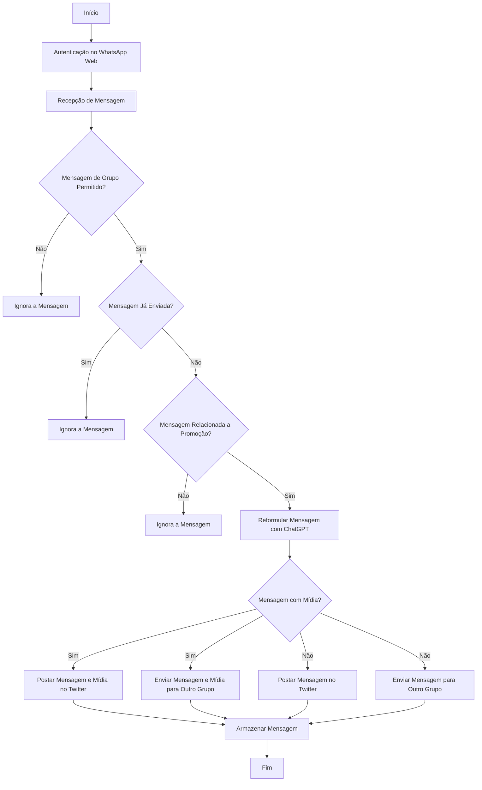

# WhatsApp to Twitter Bot

Este projeto é um bot que recebe mensagens de grupos do WhatsApp, verifica se são relacionadas a promoções, reformula usando ChatGPT e envia para o Twitter e outros grupos do WhatsApp automaticamente, sim eu fiz isso só de meme porque vi várias promoções e tive preguiça de entrar em cada um dos grupos e reorganizar da maneira que eu consiga pegar as melhores promoções pra mim em uma lista simples, aproveitei e pensei em tirar uma graninha no twitter com isso, então há um dos twitters de promoção que é meukkkkkkkkk.

## Funcionalidades

- Recebe mensagens de grupos específicos do WhatsApp
- Verifica se a mensagem já foi enviada anteriormente
- Verifica se a mensagem é relacionada a promoções
- Reformula a mensagem usando ChatGPT
- Envia a mensagem reformulada para o Twitter
- Envia a mensagem reformulada para outros grupos do WhatsApp
- Armazena as mensagens enviadas para evitar duplicação

## Tecnologias Utilizadas

- Node.js
- TypeScript
- WhatsApp Web.js
- Twit
- Axios
- Config
- Dotenv

## Estrutura do Projeto

```
whatsapp-twitter-bot/
│
├── src/
│   ├── config/
│   │   └── twitter.ts
│   │   └── config.yml
│   ├── controllers/
│   │   └── messageController.ts
│   ├── serviços/
│   │   ├── chatgptService.ts
│   │   ├── twitterService.ts
│   │   └── whatsappService.ts
│   └── index.ts
├── data/
│   └── sentMessages.json
├── .env
└── package.json
```

## Configuração

1. Clone o repositório:
   ```sh
   git clone esse repo
   cd whatsapp-twitter-bot
   ```

2. Instale as dependências:
   ```sh
   npm install
   ```

3. Configure as variáveis de ambiente no arquivo `.env`:
   ```env
   NODE_ENV=development
   ```

4. Configure o arquivo `config.yml` com suas próprias chaves e tokens:
   ```yaml
   Twitter:
     consumer_key: your_consumer_key
     consumer_secret: your_consumer_secret
     access_token: your_access_token
     access_token_secret: your_access_token_secret

   OpenAI:
     api_key: your_openai_api_key

   WhatsApp:
     allowed_groups:
       - grupo_id_1
       - grupo_id_2
   ```

## Execução

Para iniciar o bot, execute o comando:
```sh
npm start
```

## Autenticação no WhatsApp Web

Na primeira execução, o bot vai gerar um QR code no console. Escaneie o QR code com o aplicativo do WhatsApp para autenticar.

## Fluxograma do Funcionamento do Bot


